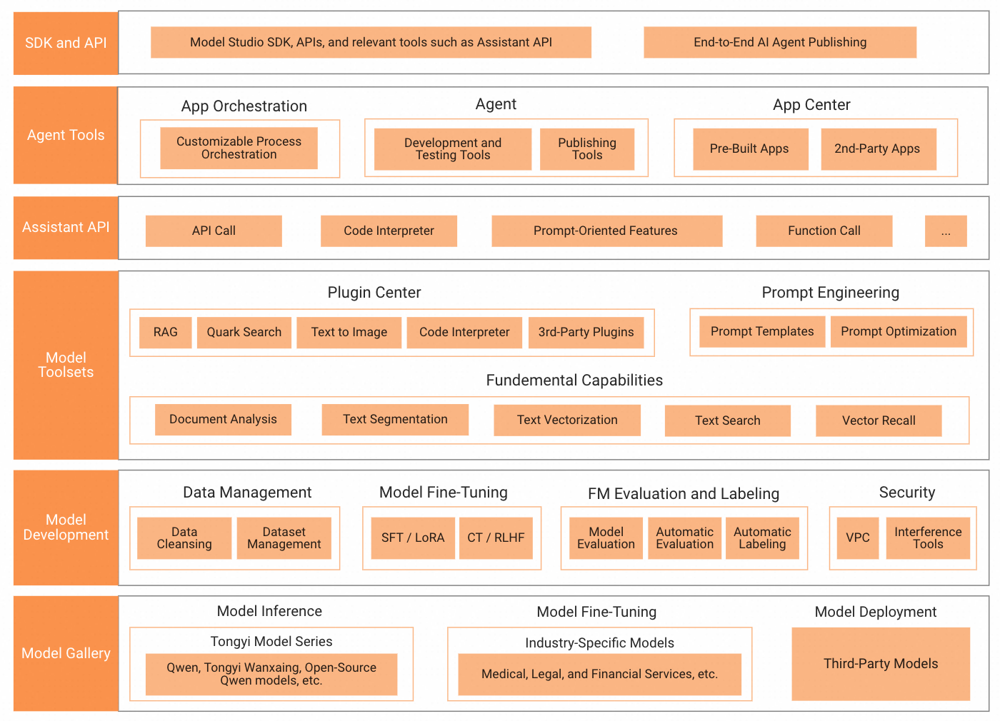
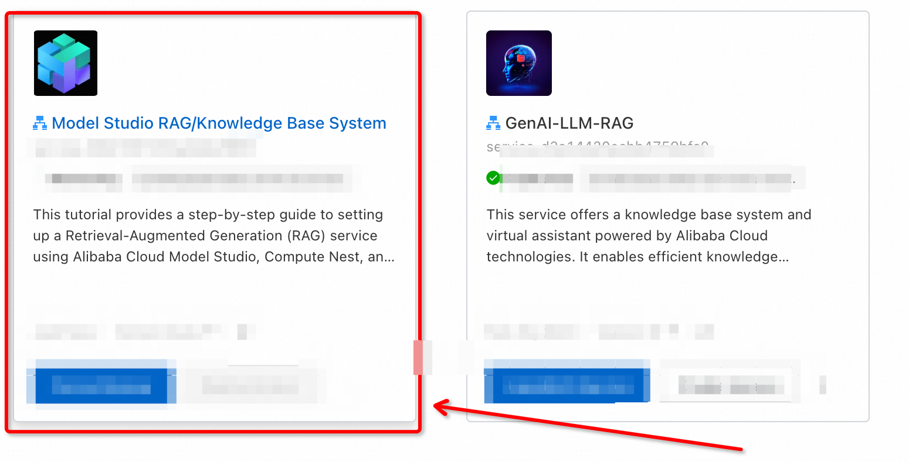
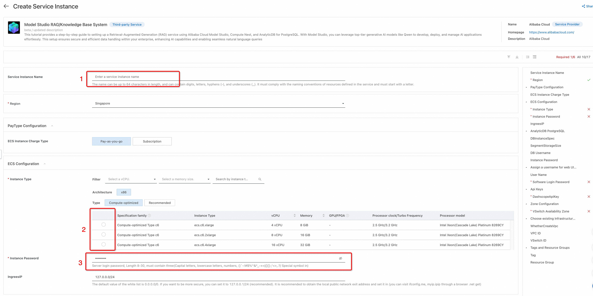
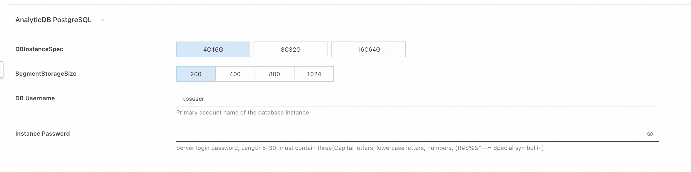
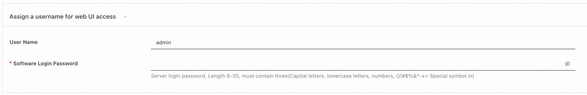
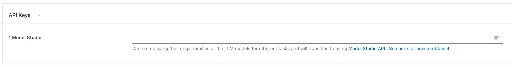
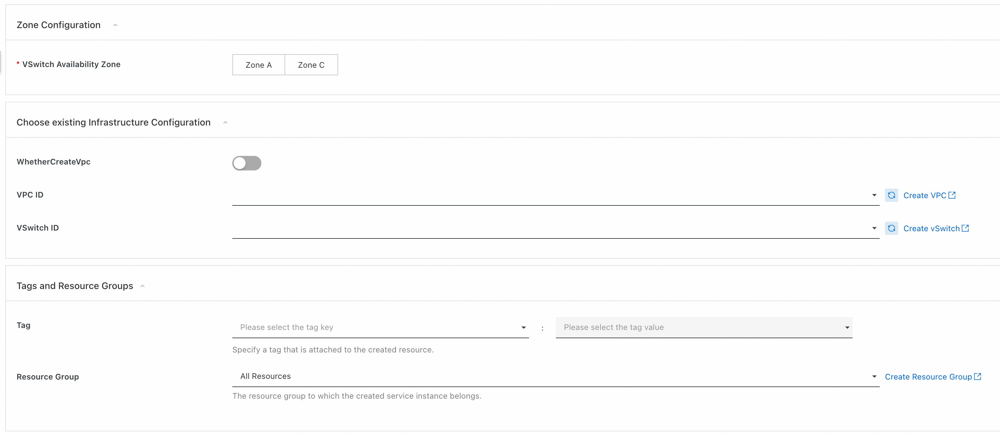
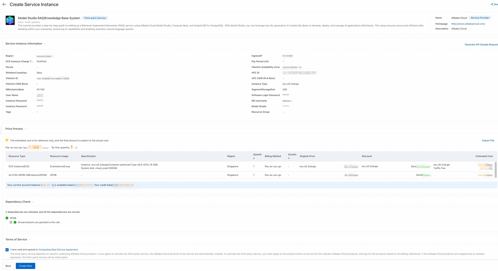
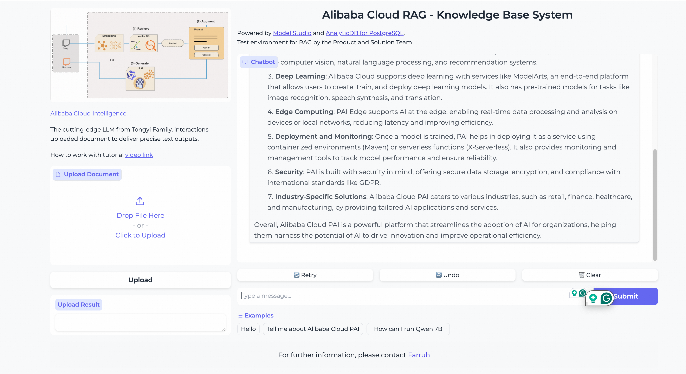

# Building a Retrieval-Augmented Generation (RAG) Service on Compute Nest with Alibaba Cloud Model Studio and AnalyticDB for PostgreSQL

This tutorial provides a step-by-step guide to setting up a Retrieval-Augmented Generation (RAG) service using Alibaba Cloud Model Studio, Compute Nest, and AnalyticDB for PostgreSQL. With Model Studio, you can leverage top-tier generative AI models like Qwen to develop, deploy, and manage AI applications effortlessly. This setup ensures secure and efficient data handling within your enterprise, enhancing AI capabilities and enabling seamless natural language queries.

## Introduction

Alibaba Cloud Model Studio provides a comprehensive platform for developing generative AI applications. Using Compute Nest and AnalyticDB for PostgreSQL, you can create a secure, efficient Retrieval-Augmented Generation (RAG) service to enhance AI capabilities within your enterprise.

## Overview of Alibaba Cloud Model Studio

*Features shown in this diagram will be launched gradually

### What is Model Studio?

[Alibaba Cloud Model Studio](https://www.alibabacloud.com/en/product/modelstudio) is an end-to-end platform aimed at simplifying the development, deployment, and management of generative AI models. With access to industry-leading foundation models like Qwen-Max, Qwen-Plus, Qwen-Turbo, and Qwen 2 series, Model Studio provides tools for model fine-tuning, evaluation, deployment, and integration with enterprise systems.

### Key Capabilities of Model Studio

1. **Easy Access to Leading Foundation Models (FM)**:
   - Models like Qwen-Max, Qwen-Plus, Qwen-Turbo, and the Qwen 2 series power your applications with enhanced AI capabilities.

2. **Built-In Model Inference and Evaluation Workflows**:
   - Support for Supervised Fine-Tuning (SFT) and Low-Rank Adaptation (LoRA).
   - Model compression, inference acceleration, and multi-dimensional evaluation tools.
   - One-click model deployment.

3. **Simplified Generative AI Application Development**:
   - Visual workflows for developing applications.
   - Template-based prompt engineering.
   - Extensive APIs for integration with business systems.

4. **Comprehensive Security Measures**:
   - Isolated VPC networks for securing data.
   - tools for content governance and human-in-the-loop interventions to ensure responsible AI practices.

5. **Third-Party Models**:
   - Support for third-party models like Tongyi, showcased in Q&A, writing, and NL2SQL (Natural Language to SQL) functionalities.

6. **Data Management**:
   - Dataset cleansing and management.
   - Retrieval-Augmented Generation (RAG) for enhanced search and data access.

7. **Industry-Specific Models**:
   - Custom models for sectors like healthcare, finance, and legal services.

8. **API and SDK**:
   - Assistant API and a suite of SDKs for quick integration and agent development.

## Prerequisites

Before starting, ensure you have:
- An active Alibaba Cloud account.
- Familiarity with cloud services and AI models.

## Step 1: Alibaba Cloud Account Setup

If you haven't already, sign up for an Alibaba Cloud account:
[Sign up](https://www.alibabacloud.com/).

## Step 2: Access Compute Nest

Navigate to Compute Nest and locate the service for Generative AI:
[Compute Nest](https://computenest.console.aliyun.com/service/instance/create/ap-southeast-1?type=user&ServiceId=service-09b1567c53a44da78fbf&ServiceVersion=beta)

.

## Step 3: Set Up an Instance and Its Parameters

Configure the necessary parameters for the instance:

1. **Service Instance Name**: Provide a meaningful name for the instance.
2. **Elastic Computing Services (ECS) Parameters**: Recommended to choose `ecs.c6.2xlarge` for faster document processing.
3. **Instance Password**: Create a secure password for the instance.

## Step 4: Setup AnalyticDB for PostgreSQL

Configure an AnalyticDB for PostgreSQL instance:

1. **Instance Specification**: Select the suitable specification based on your data volume.
2. **Segment Storage Size**: Adjust according to your needs.
3. **DB Username**: By default `kbsuser`, or choose your own username.
4. **DB Password**: Create a strong password (avoid using symbols like "@").

## Step 5: Configure WebUI Credentials

Configure the web UI credentials to manage and interact with your RAG service:

1. **Username**: Default is `admin`, or choose another username.
2. **Password**: Create a strong, secure password.

## Step 6: Add Model Studio API Key

Add your Model Studio API key to authenticate and facilitate communication between services:

 **API Key**: Enter the API key you obtained from your Model Studio setup.

Here is a guide on how to obtain your [Model Studio API key](https://www.alibabacloud.com/help/en/model-studio/developer-reference/get-api-key).

## Step 7: Network Configuration

Choose the appropriate network settings to ensure secure and reliable connectivity:

### Choose Existing Infrastructure Configuration
1. Select whether to create a new VPC (Virtual Private Cloud) or use an existing one.
   
   **WhetherCreateVpc**: Choose `Create` if you need a new VPC.
   
2. **VPC ID**: Enter the ID of an existing VPC or create a new one.
   
   **Create VPC**: If creating a new VPC, follow the [Alibaba Cloud VPC Creation Guide](https://www.alibabacloud.com/help/doc-detail/65398.htm).

3. **VSwitch ID**: Select the ID of an existing VSwitch or create a new one.
   
   **Create VSwitch**: Instructions are available in the [VSwitch Creation Guide](https://www.alibabacloud.com/help/doc-detail/65399.htm).

4. **Tags and Resource Groups**:
   - **Tag**: Specify a tag that is attached to the created resource.
     - **Tag Key**: Choose the tag key.
     - **Tag Value**: Choose the tag value.
   - **Resource Group**: Select the resource group to which the created service instance belongs.
   
   **Create Resource Group**: Follow the instructions to [Create a Resource Group](https://www.alibabacloud.com/help/doc-detail/94497.htm).
 
After configuring these settings, click **Next: Confirm Order**.

By following these steps, you will ensure that your WebUI credentials and network settings are correctly configured to support your Alibaba Cloud Model Studio RAG service effectively.

After setting up these parameters, click **Next: Confirm Order**.

 for installation and configuration.
2. **Integrate Services**: Connect Gradio to your backend services (Model Studio API endpoints and AnalyticDB for PostgreSQL).

## Step 9: Deploy Your RAG Service

Review all configurations and accept the **Terms of Service**. Click **Create Now** to deploy your RAG service.

## Using the RAG Service

### General Question Answering

Users can ask questions via the Gradio web interface, and the Model Studio API will provide responses based on the input.

### Uploading Documents for Retrieval Augmentation

Users can upload documents which will be stored in the vector database, enhancing the model's retrieval capabilities.

### Modifying the Service

Authorized users can access the ECS instance to make any necessary changes or updates to the service.

## Additional Resources

To further explore and optimize your RAG service, check the following resources:
- [Alibaba Cloud Model Studio Website](https://www.alibabacloud.com/en/product/modelstudio)
- [Alibaba Cloud Model Studio Documentation](https://www.alibabacloud.com/help/en/model-studio/)
- [Compute Nest Documentation](https://www.alibabacloud.com/blog/compute-nest-enabling-cutting-edge-generative-ai-integration-and-knowledge-base-systems-in-collaboration-with-alibaba-cloud_600421)
- [AnalyticDB for PostgreSQL Documentation](https://www.alibabacloud.com/help/product/28108.htm)
- [Gradio Documentation](https://www.gradio.app/docs/interface)

**Related Tutorials:**
- [Empowering Generative AI with Alibaba Cloud PAI's Advanced LLM and LangChain Features](https://www.alibabacloud.com/blog/empowering-generative-ai-with-alibaba-cloud-pais-advanced-llm-and-langchain-features_600577)
- [Quickly Building a RAG Service on ComputeNest](https://www.alibabacloud.com/blog/quickly-building-a-rag-service-on-compute-nest-with-llm-on-pai-eas-and-analyticdb-for-postgresql_600783)
- [Streamlined Deployment and Integration of Large Language Models with PAI-EAS](https://www.alibabacloud.com/blog/streamlined-deployment-and-integration-of-large-language-models-with-pai-eas_600762)
- [Deploy Your Own AI Chat Buddy - The Qwen Chat Model Deployment with Hugging Face Guide](https://www.alibabacloud.com/blog/deploy-your-own-ai-chat-buddy---the-qwen-chat-model-deployment-with-hugging-face-guide_600859)
- [Igniting the AI Revolution - A Journey with Qwen, RAG, and LangChain](https://www.alibabacloud.com/blog/igniting-the-ai-revolution---a-journey-with-qwen-rag-and-langchain_600876)
- [Building Multimodal Services with Qwen and Model Studio](https://www.alibabacloud.com/blog/building-multimodal-services-with-qwen-and-model-studio_600962)
- [Next-Level Conversations: LLM + VectorDB with Alibaba Cloud Is Customizable and Cost-Efficient](https://www.alibabacloud.com/blog/next-level-conversations-llm-%2B-vectordb-with-alibaba-cloud-is-customizable-and-cost-efficient_599985)

## Conclusion

This tutorial has guided you through the comprehensive process of building a Retrieval-Augmented Generation (RAG) service using Alibaba Cloud Model Studio, Compute Nest, and AnalyticDB for PostgreSQL. By leveraging Model Studio's powerful suite of generative AI models, including Qwen, you can streamline the development, deployment, and management of AI applications within your enterprise. This setup ensures secure, scalable, and efficient interactions, from natural language queries to document retrieval enhancements. Following these steps will enable you to harness advanced AI capabilities, thereby transforming data management and utilization within your organization. For ongoing optimization and support, consider exploring the additional resources and related tutorials provided.